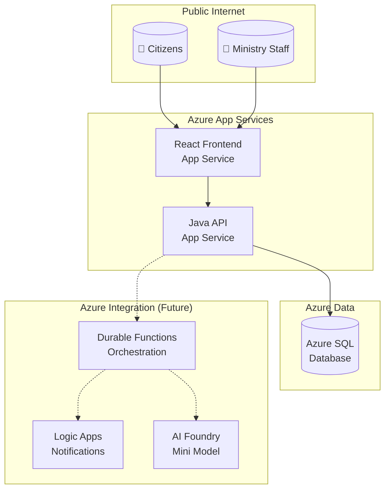
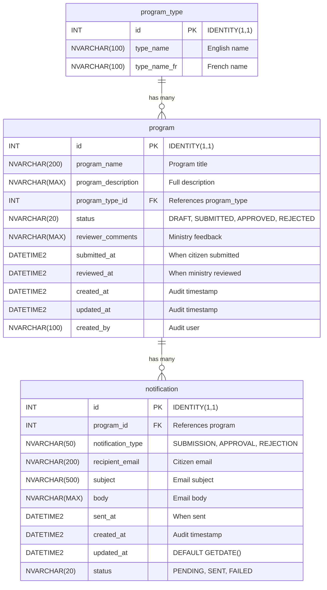

<!-- markdownlint-disable-file -->
# Implementation Details: CIVIC Demo Scaffolding

## Context Reference

Sources: [demo-scaffolding-research.md](../../research/2026-03-02/demo-scaffolding-research.md)

---

## Implementation Phase 1: Configuration Files

<!-- parallelizable: true -->

### Step 1.1: Create `.gitignore`

Create combined Java + Node + IDE + OS ignore rules at repository root.

Files:
* `.gitignore` - Combined ignore rules for full-stack development

Content specification (from research Lines 95-130):
```gitignore
# Java
target/
*.class
*.jar
*.war
*.ear
*.log
.mvn/timing.properties
.mvn/wrapper/maven-wrapper.jar

# Node
node_modules/
dist/
build/
.env
.env.local
.env.*.local
npm-debug.log*
yarn-debug.log*
yarn-error.log*

# IDE
.idea/
*.iml
*.ipr
*.iws
.project
.classpath
.settings/
*.swp
*.swo

# VS Code (preserve mcp.json)
.vscode/*
!.vscode/mcp.json

# OS
.DS_Store
.DS_Store?
._*
Thumbs.db
ehthumbs.db

# Copilot tracking (keep structure, ignore temp files)
.copilot-tracking/sandbox/
```

Success criteria:
* File exists at repository root
* Contains all sections: Java, Node, IDE, VS Code, OS, Copilot tracking
* VS Code section preserves `mcp.json`

Dependencies:
* None - first file in sequence

---

### Step 1.2: Create `.vscode/mcp.json`

Create ADO MCP server configuration for work item management.

Files:
* `.vscode/mcp.json` - MCP server configuration

Content specification (from research Lines 132-150):
```json
{
  "inputs": [],
  "servers": {
    "azure-devops": {
      "command": "npx",
      "args": [
        "-y",
        "azure-devops-mcp",
        "--organization",
        "MngEnvMCAP675646",
        "--project",
        "ProgramDemo-DevDay2026-DryRun3"
      ]
    }
  }
}
```

Success criteria:
* Valid JSON syntax
* Organization: `MngEnvMCAP675646`
* Project: `ProgramDemo-DevDay2026-DryRun3`

Dependencies:
* `.gitignore` should preserve this file

---

### Step 1.3: Create `.github/copilot-instructions.md`

Create global Copilot context file with project overview, tech stack, and coding standards.

Files:
* `.github/copilot-instructions.md` - Global Copilot instructions

Frontmatter:
```yaml
---
description: "Global Copilot instructions for CIVIC program submission system"
---
```

Content sections (from research Lines 152-230):
1. **Project Overview** - CIVIC description and purpose
2. **Technical Stack** table - Frontend, Backend, Database, UI Framework, i18n
3. **Coding Standards** - Accessibility (WCAG 2.2 Level AA)
   * All interactive elements must have `aria-label` or `aria-labelledby`
   * Form inputs must have associated labels
   * Color contrast ratio minimum 4.5:1
   * Keyboard navigation for all functionality
   * `lang` attribute on `<html>` element
4. **Bilingual Support** - i18next usage, translation file paths
5. **Ontario Design System** - CSS classes, layout patterns
6. **Azure DevOps Integration**
   * Commit message format: `type(scope): description AB#{workItemId}`
   * Branch naming: `feature/{workItemId}-short-description`
   * PR conventions

Success criteria:
* Valid YAML frontmatter with `description`
* No `applyTo` (global scope)
* All sections complete with no placeholders
* Commit format includes `AB#` pattern

Dependencies:
* None

---

### Step 1.4: Create `.github/instructions/ado-workflow.instructions.md`

Create ADO workflow conventions for branching, commits, and PRs.

Files:
* `.github/instructions/ado-workflow.instructions.md` - ADO workflow conventions

Frontmatter (from research Lines 232-240):
```yaml
---
description: "Azure DevOps workflow conventions for branching, commits, and PRs"
applyTo: "**"
---
```

Content sections:
1. Branch from `main` for all features
2. Branch naming: `feature/{workItemId}-description`
3. Commit message format with `AB#{id}` suffix
4. PR title and body conventions
5. Auto-close work items with `Fixes AB#{id}`
6. Post-merge cleanup steps

Success criteria:
* Valid YAML frontmatter with `description` and `applyTo: "**"`
* Complete workflow documentation
* Examples for each convention

Dependencies:
* `.github/` directory exists (created by copilot-instructions.md)

---

### Step 1.5: Create `.github/instructions/java.instructions.md`

Create Java and Spring Boot coding standards for backend development.

Files:
* `.github/instructions/java.instructions.md` - Java/Spring Boot standards

Frontmatter (from research Lines 242-250):
```yaml
---
description: "Java and Spring Boot coding standards for backend development"
applyTo: "backend/**"
---
```

Content sections (from research Lines 252-280):
1. Java 21 features (records, pattern matching, text blocks)
2. Spring Boot 3.x conventions
3. Spring Data JPA with repository pattern
4. Constructor injection (no `@Autowired` on fields)
5. `@Valid` and Bean Validation annotations
6. `ResponseEntity<T>` for all controller returns
7. `ProblemDetail` (RFC 7807) for error responses
8. Flyway migrations for schema management
9. H2 local profile with `MODE=MSSQLServer`
10. Package structure: `com.ontario.program.{controller,service,repository,entity,dto}`

Success criteria:
* Valid YAML frontmatter with `applyTo: "backend/**"`
* All Spring Boot conventions documented
* Package structure defined

Dependencies:
* `.github/instructions/` directory exists

---

### Step 1.6: Create `.github/instructions/react.instructions.md`

Create React and TypeScript coding standards for frontend development.

Files:
* `.github/instructions/react.instructions.md` - React/TypeScript standards

Frontmatter (from research Lines 282-290):
```yaml
---
description: "React and TypeScript coding standards for frontend development"
applyTo: "frontend/**"
---
```

Content sections (from research Lines 292-320):
1. React 18 with TypeScript
2. Vite build tool (`server.port: 3000` in vite.config.ts)
3. Functional components with hooks (no class components)
4. i18next for EN/FR translations
5. Ontario Design System CSS classes
6. WCAG 2.2 Level AA compliance:
   * `aria-*` attributes on interactive elements
   * Semantic HTML (`<main>`, `<nav>`, `<section>`)
   * Keyboard navigation support
   * `lang` attribute on root element
7. `react-router-dom` for routing
8. axios for API calls
9. Component file naming: PascalCase (e.g., `SubmitProgram.tsx`)

Success criteria:
* Valid YAML frontmatter with `applyTo: "frontend/**"`
* Accessibility requirements documented
* Ontario Design System usage specified

Dependencies:
* `.github/instructions/` directory exists

---

### Step 1.7: Create `.github/instructions/sql.instructions.md`

Create SQL and Flyway migration standards for database development.

Files:
* `.github/instructions/sql.instructions.md` - SQL/Flyway standards

Frontmatter (from research Lines 322-330):
```yaml
---
description: "SQL and Flyway migration standards for database development"
applyTo: "database/**"
---
```

Content sections (from research Lines 332-360):
1. Target: Azure SQL Database
2. Flyway versioned migrations: `V001__description.sql`
3. Use `NVARCHAR` for bilingual text columns
4. `IF NOT EXISTS` guards for idempotent migrations
5. `INT IDENTITY(1,1)` for primary keys
6. `DATETIME2` for timestamps (not `DATETIME`)
7. Seed data pattern: `INSERT ... WHERE NOT EXISTS` (never MERGE)
8. Audit columns: `created_at`, `updated_at`, `created_by` where appropriate
9. Foreign key naming: `FK_{child}_{parent}`
10. Index naming: `IX_{table}_{column}`

Success criteria:
* Valid YAML frontmatter with `applyTo: "database/**"`
* No MERGE statements documented (H2 compatibility)
* NVARCHAR usage specified for bilingual columns

Dependencies:
* `.github/instructions/` directory exists

---

### Step 1.8: Commit configuration files

Commit all 7 configuration files with specified message.

Commit message: `docs: add Copilot instructions and MCP configuration`

Files included:
* `.gitignore`
* `.vscode/mcp.json`
* `.github/copilot-instructions.md`
* `.github/instructions/ado-workflow.instructions.md`
* `.github/instructions/java.instructions.md`
* `.github/instructions/react.instructions.md`
* `.github/instructions/sql.instructions.md`

Success criteria:
* Commit message follows format
* All 7 files in single commit

Dependencies:
* All Phase 1 files created

---

### Step 1.9: Validate phase changes

Validation checks:
* Verify YAML frontmatter syntax on all .md files
* Verify JSON syntax in `.vscode/mcp.json`
* Verify no placeholder text remains

---

## Implementation Phase 2: Documentation Files

<!-- parallelizable: true -->

### Step 2.1: Create `docs/architecture.md`

Create architecture documentation with Mermaid C4/flowchart diagram.

Files:
* `docs/architecture.md` - System architecture documentation

Content sections (from research Lines 365-420):

1. **System Overview** - CIVIC architecture description
2. **Mermaid Diagram**:

3. **Component Descriptions** - Frontend, Backend, Database roles
4. **Data Flow** - Request/response patterns
5. **Security** - RBAC authentication notes
6. **Integration Points** - Future: Durable Functions, Logic Apps, AI Foundry

Success criteria:
* Mermaid diagram renders correctly
* All components described
* Future integrations shown as dashed lines

Dependencies:
* `docs/` directory created

---

### Step 2.2: Create `docs/data-dictionary.md`

Create data dictionary with Mermaid ER diagram and table specifications.

Files:
* `docs/data-dictionary.md` - Database schema documentation

Content sections (from research Lines 422-510):

1. **Entity Relationship Diagram**:


2. **Table Specifications** - Detailed column tables for:
   * `program_type` - 3 columns (id, type_name, type_name_fr)
   * `program` - 11 columns with audit fields
   * `notification` - 10 columns with status tracking

3. **Seed Data** - 5 program types with EN/FR pairs:
   | id | type_name | type_name_fr |
   |----|-----------|--------------|
   | 1 | Community Services | Services communautaires |
   | 2 | Health & Wellness | Santé et bien-être |
   | 3 | Education & Training | Éducation et formation |
   | 4 | Environment & Conservation | Environnement et conservation |
   | 5 | Economic Development | Développement économique |

4. **Seed Data Pattern** - `INSERT ... WHERE NOT EXISTS` (no MERGE)

Success criteria:
* ER diagram renders correctly with relationships
* All 3 tables fully specified
* Seed data complete with French translations
* No MERGE pattern used

Dependencies:
* `docs/` directory exists

---

### Step 2.3: Create `docs/design-document.md`

Create design document with API endpoints, DTOs, and frontend component hierarchy.

Files:
* `docs/design-document.md` - API and component design documentation

Content sections (from research Lines 500-580):

1. **API Endpoints** - 5 endpoints:

   | # | Method | Path | Description |
   |---|--------|------|-------------|
   | 1 | POST | /api/programs | Submit a program |
   | 2 | GET | /api/programs | List programs (paginated) |
   | 3 | GET | /api/programs/{id} | Get single program |
   | 4 | PUT | /api/programs/{id}/review | Approve/reject |
   | 5 | GET | /api/program-types | Dropdown values |

2. **Request/Response DTOs**:
   * `ProgramCreateRequest` - record with validation annotations
   * `ProgramResponse` - response DTO with nested type
   * `ReviewRequest` - status pattern constraint
   * `ProgramTypeResponse` - lookup response

3. **Error Handling** - RFC 7807 ProblemDetail format

4. **Frontend Component Hierarchy**:
```
App
├── Layout
│   ├── Header (Ontario header + LanguageToggle)
│   ├── Main (react-router outlet)
│   └── Footer (Ontario footer)
├── Pages
│   ├── SubmitProgram (citizen form)
│   ├── SubmitConfirmation (success page)
│   ├── SearchPrograms (list + search)
│   ├── ReviewDashboard (ministry list)
│   └── ReviewDetail (ministry approve/reject)
└── Components
    ├── LanguageToggle
    ├── ProgramForm
    ├── ProgramCard
    └── StatusBadge
```

5. **Vite Configuration** - port 3000, proxy to 8080

Success criteria:
* All 5 API endpoints documented
* DTO code examples complete
* Component hierarchy shows all pages
* Vite proxy configuration included

Dependencies:
* `docs/` directory exists

---

### Step 2.4: Commit documentation files

Commit all 3 documentation files with specified message.

Commit message: `docs: add architecture, data dictionary, and design documentation`

Files included:
* `docs/architecture.md`
* `docs/data-dictionary.md`
* `docs/design-document.md`

Success criteria:
* Commit message follows format
* All 3 files in single commit

Dependencies:
* All Phase 2 files created

---

### Step 2.5: Validate phase changes

Validation checks:
* Verify Mermaid syntax renders correctly (3 diagrams)
* Verify all tables have complete column specifications
* Verify no placeholder text remains

---

## Implementation Phase 3: Operational Scripts

<!-- parallelizable: true -->

### Step 3.1: Create `scripts/Start-Local.ps1`

Create PowerShell script for starting local development servers.

Files:
* `scripts/Start-Local.ps1` - Local development startup script

Content specification (from research Lines 600-660):

Parameters:
* `-SkipBuild` - Skip Maven/npm build steps
* `-BackendOnly` - Start only backend server
* `-FrontendOnly` - Start only frontend server
* `-UseAzureSql` - Use Azure SQL instead of H2

Configuration:
* Backend port: 8080
* Frontend port: 3000
* Backend command: `mvn spring-boot:run`
* Frontend command: `npm run dev`
* H2 profile: default local
* Azure SQL profile: activated with `-UseAzureSql`

Help documentation:
* `.SYNOPSIS` - One-line description
* `.DESCRIPTION` - Full explanation
* `.PARAMETER` - Document each parameter
* `.EXAMPLE` - At least 2 usage examples

Success criteria:
* All 4 parameters documented
* Port numbers correct (8080, 3000)
* Profile selection logic included
* Help documentation complete

Dependencies:
* `scripts/` directory created

---

### Step 3.2: Create `scripts/Stop-Local.ps1`

Create PowerShell script for stopping local development servers.

Files:
* `scripts/Stop-Local.ps1` - Local development shutdown script

Content specification (from research Lines 662-690):

```powershell
<#
.SYNOPSIS
    Stop local development servers for CIVIC application.

.DESCRIPTION
    Kills processes running on backend port 8080 and frontend port 3000.

.EXAMPLE
    .\Stop-Local.ps1
    Stop all local development servers.
#>

$ErrorActionPreference = 'SilentlyContinue'
$BackendPort = 8080
$FrontendPort = 3000

Write-Host "Stopping processes on port $BackendPort..." -ForegroundColor Yellow
Get-NetTCPConnection -LocalPort $BackendPort -ErrorAction SilentlyContinue |
    ForEach-Object { Stop-Process -Id $_.OwningProcess -Force -ErrorAction SilentlyContinue }

Write-Host "Stopping processes on port $FrontendPort..." -ForegroundColor Yellow
Get-NetTCPConnection -LocalPort $FrontendPort -ErrorAction SilentlyContinue |
    ForEach-Object { Stop-Process -Id $_.OwningProcess -Force -ErrorAction SilentlyContinue }

Write-Host "Local servers stopped." -ForegroundColor Green
```

Success criteria:
* Stops processes on ports 8080 and 3000
* Uses `SilentlyContinue` for error handling
* Help documentation complete

Dependencies:
* `scripts/` directory exists

---

### Step 3.3: Commit operational scripts

Commit all 2 operational scripts with specified message.

Commit message: `chore: add local development scripts`

Files included:
* `scripts/Start-Local.ps1`
* `scripts/Stop-Local.ps1`

Success criteria:
* Commit message follows format
* Both files in single commit

Dependencies:
* All Phase 3 files created

---

### Step 3.4: Validate phase changes

Validation checks:
* Verify PowerShell syntax (PSScriptAnalyzer if available)
* Verify help documentation complete
* Verify port numbers correct

---

## Implementation Phase 4: Talk Track

<!-- parallelizable: false -->

### Step 4.1: Create `TALK-TRACK.md`

Create 130-minute talk track at repository root with two-presenter format.

Files:
* `TALK-TRACK.md` - Demo talk track at repository root

Content sections (from research Lines 700-870):

1. **Presenter Key**:
   | Emoji | Presenter | Role |
   |-------|-----------|------|
   | 🎙️ | HAMMAD | MC — sets context, asks questions |
   | 💻 | EMMANUEL | Keyboard — drives live coding |

2. **Part 1: Building From Zero** (Minutes 0–70 | 10:30 AM – 11:40 AM)
   * Opening (0–8) - Problem introduction
   * Act 1: The Architect (8–20) - Scaffolding + ADO via MCP
   * Act 2: The DBA (20–32) - Flyway migrations
   * Act 3: The Backend Developer (32–52) - Spring Boot API
   * Act 4: The Frontend Developer (52–70) - React portal

3. **Cliffhanger** (Minute 70 | 11:40 AM) - Ministry portal incomplete

4. **Lunch Break** (11:40 AM – 1:00 PM)

5. **Part 2: Closing the Loop** (Minutes 70–130 | 1:00 PM – 1:50 PM)
   * Recap (70–73) - Part 1 summary
   * Act 5: Completing the Story (73–87) - Ministry portal
   * Act 6: The QA Engineer (87–100) - Tests
   * Act 7: The DevOps Engineer (100–107) - CI/CD
   * Act 8: The Full Stack Change (107–120) - program_budget field
   * Closing (120–130) - Summary + Q&A

6. **Talk Track Formatting**:
   * Two-presenter format with emojis
   * Scripted dialogue in blockquotes
   * Demo actions: `(min X | ⏰ HH:MM AM)`
   * Key beat callouts
   * Audience engagement points

7. **Tagged Commit Checkpoints** table (8 tags: v0.1.0 → v1.0.0)

8. **Risk Mitigation Table**

9. **Key Numbers Summary Table**

Success criteria:
* All 130 minutes covered
* Two-presenter format throughout
* Timestamps on all sections
* 8 commit checkpoint tags documented
* Risk mitigation table complete

Dependencies:
* None - standalone file at root

---

### Step 4.2: Commit talk track

Commit talk track with specified message.

Commit message: `docs: add 130-minute talk track for CIVIC demo`

Files included:
* `TALK-TRACK.md`

Success criteria:
* Commit message follows format
* Single file commit

Dependencies:
* Phase 4 Step 4.1 complete

---

### Step 4.3: Validate phase changes

Validation checks:
* Verify all 130 minutes covered with timestamps
* Verify two-presenter format (🎙️ HAMMAD + 💻 EMMANUEL) throughout
* Verify 8 checkpoint tags documented
* Verify risk mitigation table complete

---

## Implementation Phase 5: Final Validation

<!-- parallelizable: false -->

### Step 5.1: Run full project validation

Validation checklist:

| # | Check | Expected |
|---|-------|----------|
| 1 | `.gitignore` exists | ✓ |
| 2 | `.vscode/mcp.json` valid JSON | ✓ |
| 3 | `.github/copilot-instructions.md` has frontmatter | ✓ |
| 4 | `.github/instructions/ado-workflow.instructions.md` has frontmatter + applyTo | ✓ |
| 5 | `.github/instructions/java.instructions.md` has frontmatter + applyTo | ✓ |
| 6 | `.github/instructions/react.instructions.md` has frontmatter + applyTo | ✓ |
| 7 | `.github/instructions/sql.instructions.md` has frontmatter + applyTo | ✓ |
| 8 | `docs/architecture.md` Mermaid renders | ✓ |
| 9 | `docs/data-dictionary.md` Mermaid renders | ✓ |
| 10 | `docs/design-document.md` complete | ✓ |
| 11 | `scripts/Start-Local.ps1` has help | ✓ |
| 12 | `scripts/Stop-Local.ps1` has help | ✓ |
| 13 | `TALK-TRACK.md` covers 130 minutes | ✓ |

### Step 5.2: Fix minor validation issues

Address any discovered issues:
* YAML syntax errors
* JSON syntax errors
* Missing content
* Placeholder text (`{{...}}`)

### Step 5.3: Report blocking issues

If critical issues found:
* Document the specific issue
* Identify affected file(s)
* Provide recommended resolution
* Escalate to user if resolution requires scope change

---

## Dependencies

* Git - version control
* VS Code - file editing
* PowerShell - script validation (optional)
* Azure DevOps MCP - work item integration (verified during demo)

## Success Criteria

* 13 files created at correct paths
* No TODOs or placeholders
* Valid YAML frontmatter on all instruction/documentation markdown files
* Valid Mermaid syntax in 3 documentation files
* Talk track covers full 130 minutes
* Two-presenter format consistent
* 4 commits with specified messages
