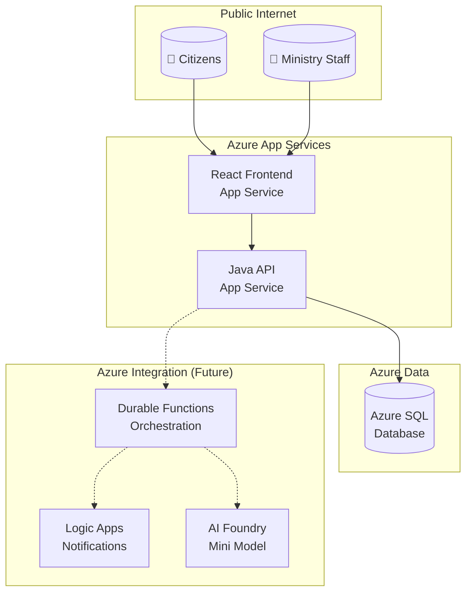
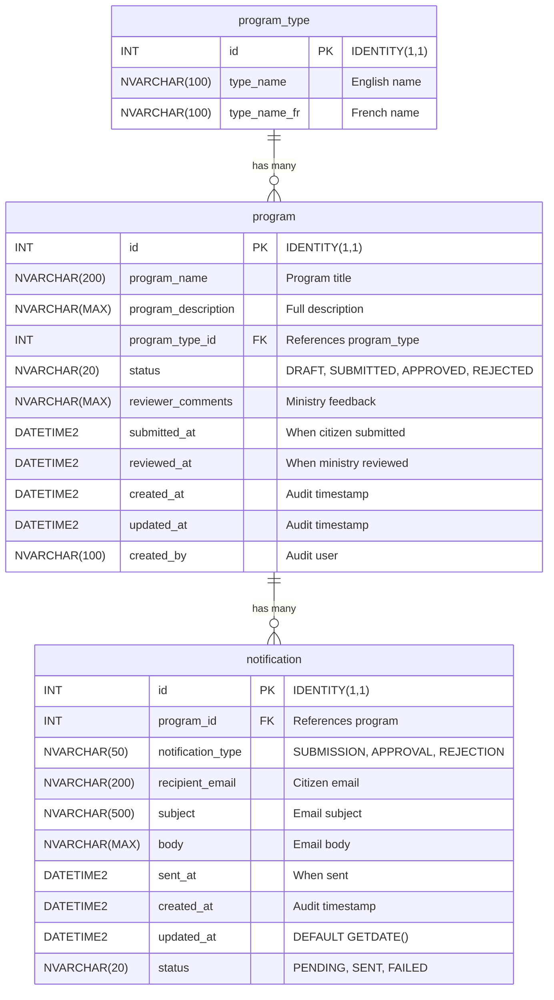

<!-- markdownlint-disable-file -->
# Task Research: CIVIC Demo Scaffolding

Research and document all scaffolding files needed for the **CIVIC** (Citizens' Ideas for a Vibrant and Inclusive Community) demo — a 130-minute live GitHub Copilot demonstration for Ontario Public Sector Developer Day 2026 — DryRun3.

## Task Implementation Requests

* Generate 13 scaffolding files across 4 phases
* Create configuration layer (7 files): `.gitignore`, MCP config, copilot-instructions, 4 instruction files
* Create documentation layer (3 files): architecture, data-dictionary, design-document
* Create operational layer (2 scripts): Start-Local.ps1, Stop-Local.ps1
* Create talk track (1 file): TALK-TRACK.md at repository root

## Scope and Success Criteria

* Scope: All scaffolding files for CIVIC demo; excludes application code, infrastructure deployment, and CD workflows
* Assumptions: Azure resources pre-deployed in `rg-dev-125`; ADO org `MngEnvMCAP675646` and project `ProgramDemo-DevDay2026-DryRun3` exist but empty
* Success Criteria:
  * All 13 files complete with no TODOs or placeholders
  * Valid YAML frontmatter on all markdown files
  * Valid Mermaid syntax in documentation files
  * Talk track covers all 130 minutes with two-presenter format

## Outline

1. Demo Context and Constraints
2. Configuration Files Specification
3. Documentation Files Specification
4. Operational Scripts Specification
5. Talk Track Specification
6. ADO Work Item Hierarchy
7. Out of Scope
8. Implementation Phases

---

## 1. Demo Context and Constraints

### Demo Overview

| Property | Value |
|----------|-------|
| Application Name | **CIVIC** — Citizens' Ideas for a Vibrant and Inclusive Community |
| Duration | 130 minutes (10:30 AM – 1:50 PM with lunch 11:40 AM – 1:00 PM) |
| Audience | Ontario Public Sector (OPS) developers and leadership |
| Presenters | 🎙️ **Hammad Aslam** (MC) + 💻 **Emmanuel** (keyboard) |
| Azure Resource Group | `rg-dev-125` (pre-deployed) |
| ADO Organization | `MngEnvMCAP675646` |
| ADO Project | `ProgramDemo-DevDay2026-DryRun3` |

### Starting State

When the demo begins, only these files exist:

1. `README.md` — business problem and tech stack
2. `.github/prompts/bootstrap-demo.prompt.md` — generates scaffolding prompts

**Nothing else exists:**

* No code, no documentation, no configuration files, no scripts
* No ADO work items — Epic, Features, Stories created via MCP in Act 1

### Technical Stack (from README.md)

| Layer | Technology |
|-------|------------|
| Frontend | React 18 + TypeScript + Vite |
| Backend | Java 21 + Spring Boot 3.x |
| Database | Azure SQL (H2 for local dev) |
| Cloud | Azure App Services, Durable Functions, Logic Apps, AI Foundry |
| UI Design | Figma + Ontario Design System |
| CI/CD | GitHub Actions |
| Security | GitHub Advanced Security (Dependabot, Secret Scanning) |
| Project Management | Azure DevOps |

### Key Constraints

* All screens bilingual (English/French) using i18next
* WCAG 2.2 Level AA accessibility compliance
* Ontario Design System CSS classes
* Commit format: `AB#{id}` linking to ADO work items
* Branch format: `feature/{id}-description`

---

## 2. Configuration Files Specification

### 2.1 `.gitignore`

Combined Java + Node + IDE + OS ignore rules.

```gitignore
# Java
target/
*.class
*.jar
*.war
*.ear
*.log
.mvn/timing.properties
.mvn/wrapper/maven-wrapper.jar

# Node
node_modules/
dist/
build/
.env
.env.local
.env.*.local
npm-debug.log*
yarn-debug.log*
yarn-error.log*

# IDE
.idea/
*.iml
*.ipr
*.iws
.project
.classpath
.settings/
*.swp
*.swo

# VS Code (preserve mcp.json)
.vscode/*
!.vscode/mcp.json

# OS
.DS_Store
.DS_Store?
._*
Thumbs.db
ehthumbs.db

# Copilot tracking (keep structure, ignore temp files)
.copilot-tracking/sandbox/
```

### 2.2 `.vscode/mcp.json`

ADO MCP server configuration for work item management.

```json
{
  "inputs": [],
  "servers": {
    "azure-devops": {
      "command": "npx",
      "args": [
        "-y",
        "azure-devops-mcp",
        "--organization",
        "MngEnvMCAP675646",
        "--project",
        "ProgramDemo-DevDay2026-DryRun3"
      ]
    }
  }
}
```

### 2.3 `.github/copilot-instructions.md`

Global Copilot context file (no `applyTo` — applies everywhere).

**Required content:**

```markdown
---
description: "Global Copilot instructions for CIVIC program submission system"
---

# CIVIC — Citizens' Ideas for a Vibrant and Inclusive Community

## Project Overview

CIVIC is a government program submission and approval system for Ontario citizens.
Citizens submit program requests through a public portal; Ministry employees review
and approve/reject submissions through an internal portal.

## Technical Stack

| Layer | Technology |
|-------|------------|
| Frontend | React 18 + TypeScript + Vite (port 3000) |
| Backend | Java 21 + Spring Boot 3.x (port 8080) |
| Database | Azure SQL (H2 with MODE=MSSQLServer for local) |
| UI Framework | Ontario Design System |
| i18n | i18next (EN/FR) |

## Coding Standards

### Accessibility (WCAG 2.2 Level AA)

* All interactive elements must have `aria-label` or `aria-labelledby`
* Form inputs must have associated labels
* Color contrast ratio minimum 4.5:1
* Keyboard navigation for all functionality
* `lang` attribute on `<html>` element

### Bilingual Support

* All user-facing text via i18next translation keys
* Translation files: `public/locales/{en,fr}/translation.json`
* Default language: English
* Language toggle in header

### Ontario Design System

* Use official CSS classes from `@ongov/ontario-design-system-global-styles`
* Follow Ontario.ca layout patterns
* Header and footer match Ontario government standards

## Azure DevOps Integration

### Commit Messages

Format: `type(scope): description AB#{workItemId}`

Examples:
- `feat(api): add program submission endpoint AB#1234`
- `fix(ui): correct French translation AB#1235`
- `test(backend): add controller tests AB#1236`

### Branch Naming

Format: `feature/{workItemId}-short-description`

Examples:
- `feature/1234-program-submission-api`
- `feature/1235-french-translations`

### Pull Requests

* Title includes work item: `feat: Add program form AB#1234`
* Body includes `Fixes AB#{id}` for auto-close
* Require at least one approval
```

### 2.4 `.github/instructions/ado-workflow.instructions.md`

**Frontmatter:**

```yaml
---
description: "Azure DevOps workflow conventions for branching, commits, and PRs"
applyTo: "**"
---
```

**Content summary:**

* Branch from `main` for all features
* Branch naming: `feature/{workItemId}-description`
* Commit message format with `AB#{id}` suffix
* PR title and body conventions
* Auto-close work items with `Fixes AB#{id}`
* Post-merge cleanup steps

### 2.5 `.github/instructions/java.instructions.md`

**Frontmatter:**

```yaml
---
description: "Java and Spring Boot coding standards for backend development"
applyTo: "backend/**"
---
```

**Content summary:**

* Java 21 features (records, pattern matching, text blocks)
* Spring Boot 3.x conventions
* Spring Data JPA with repository pattern
* Constructor injection (no `@Autowired` on fields)
* `@Valid` and Bean Validation annotations
* `ResponseEntity<T>` for all controller returns
* `ProblemDetail` (RFC 7807) for error responses
* Flyway migrations for schema management
* H2 local profile with `MODE=MSSQLServer`
* Package structure: `com.ontario.program.{controller,service,repository,entity,dto}`

### 2.6 `.github/instructions/react.instructions.md`

**Frontmatter:**

```yaml
---
description: "React and TypeScript coding standards for frontend development"
applyTo: "frontend/**"
---
```

**Content summary:**

* React 18 with TypeScript
* Vite build tool (`server.port: 3000` in vite.config.ts)
* Functional components with hooks (no class components)
* i18next for EN/FR translations
* Ontario Design System CSS classes
* WCAG 2.2 Level AA compliance:
  * `aria-*` attributes on interactive elements
  * Semantic HTML (`<main>`, `<nav>`, `<section>`)
  * Keyboard navigation support
  * `lang` attribute on root element
* `react-router-dom` for routing
* axios for API calls
* Component file naming: PascalCase (e.g., `SubmitProgram.tsx`)

### 2.7 `.github/instructions/sql.instructions.md`

**Frontmatter:**

```yaml
---
description: "SQL and Flyway migration standards for database development"
applyTo: "database/**"
---
```

**Content summary:**

* Target: Azure SQL Database
* Flyway versioned migrations: `V001__description.sql`
* Use `NVARCHAR` for bilingual text columns
* `IF NOT EXISTS` guards for idempotent migrations
* `INT IDENTITY(1,1)` for primary keys
* `DATETIME2` for timestamps (not `DATETIME`)
* Seed data pattern: `INSERT ... WHERE NOT EXISTS` (never MERGE)
* Audit columns: `created_at`, `updated_at`, `created_by` where appropriate
* Foreign key naming: `FK_{child}_{parent}`
* Index naming: `IX_{table}_{column}`

---

## 3. Documentation Files Specification

### 3.1 `docs/architecture.md`

Mermaid C4/flowchart showing system architecture.

**Required Mermaid diagram:**



**Document sections:**

1. System Overview
2. Component Descriptions
3. Data Flow
4. Security (RBAC authentication)
5. Integration Points (future: Durable Functions, Logic Apps, AI Foundry)

### 3.2 `docs/data-dictionary.md`

Mermaid ER diagram with table specifications.

**Required Mermaid ER diagram:**



**Table specifications:**

#### program_type (lookup table)

| Column | Type | Constraints | Description |
|--------|------|-------------|-------------|
| id | INT | PK, IDENTITY(1,1) | Primary key |
| type_name | NVARCHAR(100) | NOT NULL | English name |
| type_name_fr | NVARCHAR(100) | NOT NULL | French name |

No audit columns (static reference data).

#### program

| Column | Type | Constraints | Description |
|--------|------|-------------|-------------|
| id | INT | PK, IDENTITY(1,1) | Primary key |
| program_name | NVARCHAR(200) | NOT NULL | Program title |
| program_description | NVARCHAR(MAX) | NOT NULL | Full description |
| program_type_id | INT | FK, NOT NULL | References program_type |
| status | NVARCHAR(20) | DEFAULT 'DRAFT' | DRAFT, SUBMITTED, APPROVED, REJECTED |
| reviewer_comments | NVARCHAR(MAX) | NULL | Ministry feedback |
| submitted_at | DATETIME2 | NULL | When citizen submitted |
| reviewed_at | DATETIME2 | NULL | When ministry reviewed |
| created_at | DATETIME2 | NOT NULL | Audit timestamp |
| updated_at | DATETIME2 | NOT NULL | Audit timestamp |
| created_by | NVARCHAR(100) | NULL | Audit user |

#### notification

| Column | Type | Constraints | Description |
|--------|------|-------------|-------------|
| id | INT | PK, IDENTITY(1,1) | Primary key |
| program_id | INT | FK, NOT NULL | References program |
| notification_type | NVARCHAR(50) | NOT NULL | SUBMISSION, APPROVAL, REJECTION |
| recipient_email | NVARCHAR(200) | NOT NULL | Citizen email |
| subject | NVARCHAR(500) | NOT NULL | Email subject |
| body | NVARCHAR(MAX) | NOT NULL | Email body |
| sent_at | DATETIME2 | NULL | When sent |
| created_at | DATETIME2 | NOT NULL | Audit timestamp |
| updated_at | DATETIME2 | DEFAULT GETDATE() | Auto-update |
| status | NVARCHAR(20) | DEFAULT 'PENDING' | PENDING, SENT, FAILED |

**Seed data (5 program types):**

| id | type_name | type_name_fr |
|----|-----------|--------------|
| 1 | Community Services | Services communautaires |
| 2 | Health & Wellness | Santé et bien-être |
| 3 | Education & Training | Éducation et formation |
| 4 | Environment & Conservation | Environnement et conservation |
| 5 | Economic Development | Développement économique |

**Seed data SQL pattern:**

```sql
INSERT INTO program_type (type_name, type_name_fr)
SELECT 'Community Services', 'Services communautaires'
WHERE NOT EXISTS (SELECT 1 FROM program_type WHERE type_name = 'Community Services');
```

Never use MERGE — not portable to H2.

### 3.3 `docs/design-document.md`

API endpoints, DTOs, and frontend component hierarchy.

**5 API Endpoints:**

#### 1. POST /api/programs — Submit a program

**Request DTO (ProgramCreateRequest):**

```java
public record ProgramCreateRequest(
    @NotBlank @Size(max = 200) String programName,
    @NotBlank String programDescription,
    @NotNull Integer programTypeId,
    @Email String contactEmail
) {}
```

**Response DTO (ProgramResponse):**

```java
public record ProgramResponse(
    Long id,
    String programName,
    String programDescription,
    ProgramTypeResponse programType,
    String status,
    String reviewerComments,
    LocalDateTime submittedAt,
    LocalDateTime reviewedAt,
    LocalDateTime createdAt
) {}
```

**Response:** 201 Created with ProgramResponse

#### 2. GET /api/programs — List programs

**Query parameters:**

* `status` (optional): Filter by status
* `programTypeId` (optional): Filter by type
* `page` (default 0): Page number
* `size` (default 20): Page size

**Response:** 200 OK with Page<ProgramResponse>

#### 3. GET /api/programs/{id} — Get single program

**Response:** 200 OK with ProgramResponse, or 404 with ProblemDetail

#### 4. PUT /api/programs/{id}/review — Approve/reject

**Request DTO (ReviewRequest):**

```java
public record ReviewRequest(
    @NotBlank @Pattern(regexp = "APPROVED|REJECTED") String status,
    String reviewerComments
) {}
```

**Response:** 200 OK with ProgramResponse

#### 5. GET /api/program-types — Dropdown values

**Response DTO (ProgramTypeResponse):**

```java
public record ProgramTypeResponse(
    Integer id,
    String typeName,
    String typeNameFr
) {}
```

**Response:** 200 OK with List<ProgramTypeResponse>

**Error Handling (RFC 7807 ProblemDetail):**

```json
{
  "type": "about:blank",
  "title": "Not Found",
  "status": 404,
  "detail": "Program with id 999 not found",
  "instance": "/api/programs/999"
}
```

**Frontend Component Hierarchy:**

```
App
├── Layout
│   ├── Header (Ontario header + LanguageToggle)
│   ├── Main (react-router outlet)
│   └── Footer (Ontario footer)
├── Pages
│   ├── SubmitProgram (citizen form)
│   ├── SubmitConfirmation (success page)
│   ├── SearchPrograms (list + search)
│   ├── ReviewDashboard (ministry list)
│   └── ReviewDetail (ministry approve/reject)
└── Components
    ├── LanguageToggle
    ├── ProgramForm
    ├── ProgramCard
    └── StatusBadge
```

**Vite Configuration:**

```typescript
// vite.config.ts
export default defineConfig({
  server: {
    port: 3000,
    proxy: {
      '/api': 'http://localhost:8080'
    }
  }
});
```

---

## 4. Operational Scripts Specification

### 4.1 `scripts/Start-Local.ps1`

```powershell
<#
.SYNOPSIS
    Start local development servers for CIVIC application.

.DESCRIPTION
    Starts backend (Java/Spring Boot on port 8080) and/or frontend (React/Vite on port 3000).
    Supports skipping build, running only backend or frontend, and using Azure SQL.

.PARAMETER SkipBuild
    Skip Maven/npm build steps and run existing artifacts.

.PARAMETER BackendOnly
    Start only the backend server.

.PARAMETER FrontendOnly
    Start only the frontend server.

.PARAMETER UseAzureSql
    Use Azure SQL connection instead of H2 in-memory database.

.EXAMPLE
    .\Start-Local.ps1
    Start both backend and frontend with full build.

.EXAMPLE
    .\Start-Local.ps1 -SkipBuild -BackendOnly
    Start only backend without rebuilding.
#>
param(
    [switch]$SkipBuild,
    [switch]$BackendOnly,
    [switch]$FrontendOnly,
    [switch]$UseAzureSql
)

$ErrorActionPreference = 'Stop'
$BackendPort = 8080
$FrontendPort = 3000

# Implementation: Start backend with mvn spring-boot:run
# Implementation: Start frontend with npm run dev
# Implementation: Handle profile selection for H2 vs Azure SQL
```

### 4.2 `scripts/Stop-Local.ps1`

```powershell
<#
.SYNOPSIS
    Stop local development servers for CIVIC application.

.DESCRIPTION
    Kills processes running on backend port 8080 and frontend port 3000.

.EXAMPLE
    .\Stop-Local.ps1
    Stop all local development servers.
#>

$ErrorActionPreference = 'SilentlyContinue'
$BackendPort = 8080
$FrontendPort = 3000

Write-Host "Stopping processes on port $BackendPort..." -ForegroundColor Yellow
Get-NetTCPConnection -LocalPort $BackendPort -ErrorAction SilentlyContinue |
    ForEach-Object { Stop-Process -Id $_.OwningProcess -Force -ErrorAction SilentlyContinue }

Write-Host "Stopping processes on port $FrontendPort..." -ForegroundColor Yellow
Get-NetTCPConnection -LocalPort $FrontendPort -ErrorAction SilentlyContinue |
    ForEach-Object { Stop-Process -Id $_.OwningProcess -Force -ErrorAction SilentlyContinue }

Write-Host "Local servers stopped." -ForegroundColor Green
```

---

## 5. Talk Track Specification

### Presenters

| Emoji | Presenter | Role |
|-------|-----------|------|
| 🎙️ | **HAMMAD** | MC — sets context, asks questions, holds audience conversation |
| 💻 | **EMMANUEL** | Keyboard — drives all live coding and demos |

### Part 1: "Building From Zero" (Minutes 0–70 | ⏰ 10:30 AM – 11:40 AM)

#### Opening (Minutes 0–8 | ⏰ 10:30 – 10:38 AM)

**🎙️ HAMMAD** introduces the problem:

* Show empty repo (only README.md + bootstrap-demo.prompt.md)
* Show Azure portal with pre-deployed resources in `rg-dev-125`
* Show empty ADO board (no work items exist)

**Key beat:** "We're building a complete application from scratch in 130 minutes."

#### Act 1: The Architect (Minutes 8–20 | ⏰ 10:38 – 10:50 AM)

**💻 EMMANUEL** generates scaffolding:

* Run scaffolding prompts to generate config/docs/scripts
* Configure MCP for ADO integration
* **Create ADO Epic/Features/Stories via MCP** (critical — nothing exists beforehand)

**Demo actions:**

* (min 8 | ⏰ 10:38 AM) Run demo-scaffolding prompt
* (min 12 | ⏰ 10:42 AM) Generate MCP config
* (min 15 | ⏰ 10:45 AM) Create CIVIC Epic via MCP
* (min 18 | ⏰ 10:48 AM) Create Features and Stories

#### Act 2: The DBA (Minutes 20–32 | ⏰ 10:50 – 11:02 AM)

**💻 EMMANUEL** creates database:

* 4 Flyway SQL migrations: program_type, program, notification, seed data
* Show H2 local profile with MODE=MSSQLServer

**Demo actions:**

* (min 20 | ⏰ 10:50 AM) Create V001__create_program_type.sql
* (min 24 | ⏰ 10:54 AM) Create V002__create_program.sql
* (min 27 | ⏰ 10:57 AM) Create V003__create_notification.sql
* (min 30 | ⏰ 11:00 AM) Create V004__seed_program_types.sql

#### Act 3: The Backend Developer (Minutes 32–52 | ⏰ 11:02 – 11:22 AM)

**💻 EMMANUEL** builds API:

* Spring Boot scaffolding
* 5 API endpoints with live curl tests

**Demo actions:**

* (min 32 | ⏰ 11:02 AM) Generate Spring Boot project
* (min 36 | ⏰ 11:06 AM) Create entities and repositories
* (min 40 | ⏰ 11:10 AM) POST /api/programs endpoint
* (min 44 | ⏰ 11:14 AM) GET endpoints
* (min 48 | ⏰ 11:18 AM) PUT /api/programs/{id}/review
* (min 50 | ⏰ 11:20 AM) Live curl tests

#### Act 4: The Frontend Developer (Minutes 52–70 | ⏰ 11:22 – 11:40 AM)

**💻 EMMANUEL** builds citizen portal:

* React + Ontario DS + bilingual support
* Live form submission demo

**Demo actions:**

* (min 52 | ⏰ 11:22 AM) Generate React + Vite project
* (min 56 | ⏰ 11:26 AM) Create Layout with Ontario DS
* (min 60 | ⏰ 11:30 AM) Create SubmitProgram form
* (min 64 | ⏰ 11:34 AM) Add i18next translations
* (min 68 | ⏰ 11:38 AM) Live form submission

### 🔥 Cliffhanger (Minute 70 | ⏰ 11:40 AM — LUNCH BREAK)

**🎙️ HAMMAD:** "Citizens can submit CIVIC programs... but look at the Ministry Portal — it's empty! Nobody can approve anything. We have unstarted stories on our ADO board. See you after lunch to close the loop."

> ⏰ **LUNCH BREAK — 11:40 AM to 1:00 PM**

### Part 2: "Closing the Loop" (Minutes 70–130 | ⏰ RESUMING 1:00 PM)

#### Recap (Minutes 70–73 | ⏰ 1:00 – 1:03 PM)

**🎙️ HAMMAD** recaps Part 1:

* Show database with citizen submissions
* Show ADO board with remaining stories

#### Act 5: Completing the Story (Minutes 73–87 | ⏰ 1:03 – 1:17 PM)

**💻 EMMANUEL** builds ministry portal:

* Review dashboard, detail page, approve/reject

#### Act 6: The QA Engineer (Minutes 87–100 | ⏰ 1:17 – 1:30 PM)

**💻 EMMANUEL** adds tests:

* Backend controller tests
* Frontend component tests
* Accessibility tests

#### Act 7: The DevOps Engineer (Minutes 100–107 | ⏰ 1:30 – 1:37 PM)

**💻 EMMANUEL** sets up CI:

* GitHub Actions CI pipeline
* Dependabot configuration
* Secret scanning / GHAS

#### Act 8: The Full Stack Change (Minutes 107–120 | ⏰ 1:37 – 1:50 PM)

**💻 EMMANUEL** demonstrates iterative change:

* Add `program_budget` field end-to-end
* Migration → Entity → DTO → API → Form → Tests

#### Closing (Minutes 120–130 | ⏰ 1:50 – 2:00 PM)

**🎙️ HAMMAD + 💻 EMMANUEL:**

* Show ADO board all done
* Summary statistics
* Q&A

### Talk Track Formatting Requirements

* Two-presenter format: 🎙️ **HAMMAD** for MC, 💻 **EMMANUEL** for coding
* Scripted dialogue in blockquotes: `**🎙️ HAMMAD:** > "..."`
* Demo actions with minute AND time: `(min 5 | ⏰ 10:35 AM)`
* Key beat callouts: `**Key beat (EMMANUEL):**`
* Audience engagement: `**Audience engagement point (min X | ⏰ time):**`
* Timestamps in headers: `(Minutes X–Y | ⏰ HH:MM – HH:MM AM/PM)`

### Tagged Commit Checkpoints

| Tag | Minute | Time | Milestone | Recovery |
|-----|--------|------|-----------|----------|
| v0.1.0 | 20 | 10:50 AM | Scaffolding complete | Reset to here if MCP fails |
| v0.2.0 | 32 | 11:02 AM | Database migrations | Skip to v0.3.0 if behind |
| v0.3.0 | 52 | 11:22 AM | Backend API complete | Core demo achievable |
| v0.4.0 | 70 | 11:40 AM | Citizen portal (CLIFFHANGER) | Pre-lunch checkpoint |
| v0.5.0 | 87 | 1:17 PM | Ministry portal | Full workflow demo |
| v0.6.0 | 100 | 1:30 PM | Tests passing | Quality gate |
| v0.7.0 | 107 | 1:37 PM | CI/CD configured | Pipeline ready |
| v1.0.0 | 120 | 1:50 PM | Live change complete | Final demo state |

### Risk Mitigation Table

| Risk | Mitigation | Recovery Time |
|------|------------|---------------|
| Copilot errors | Manual code fallback + pre-written snippets | 2–3 min |
| Azure SQL connection | Fall back to H2 local profile | 1 min |
| Time overrun | Skip to next checkpoint tag | Instant |
| Network/connectivity | Offline mode with cached dependencies | 2 min |
| MCP failure | Manual ADO web UI for work items | 5 min |

### Key Numbers Summary Table

| Metric | Value |
|--------|-------|
| Total demo duration | 130 minutes |
| Part 1 duration | 70 minutes |
| Part 2 duration | 60 minutes |
| Lunch break | 80 minutes (11:40 AM – 1:00 PM) |
| Database tables | 3 |
| API endpoints | 5 |
| React components | ~10 |
| Flyway migrations | 4+ |
| ADO work items | ~35 |
| Commit checkpoints | 8 |

---

## 6. ADO Work Item Hierarchy

**Epic:** CIVIC — Citizens' Ideas for a Vibrant and Inclusive Community

### Feature 1: Infrastructure Setup

* Story: Azure resources verification (close immediately — pre-deployed in `rg-dev-125`)

### Feature 2: Database Layer

* Story: Create program_type lookup table
* Story: Create program table with audit columns
* Story: Create notification table
* Story: Seed program types (5 EN/FR pairs)

### Feature 3: Backend API

* Story: Spring Boot project scaffolding
* Story: POST /api/programs — submit endpoint
* Story: GET /api/programs — list/search endpoint
* Story: GET /api/programs/{id} — single program
* Story: PUT /api/programs/{id}/review — approve/reject
* Story: GET /api/program-types — dropdown values

### Feature 4: Citizen Portal

* Story: React + Vite project scaffolding
* Story: Ontario DS layout (header, footer)
* Story: Program submission form
* Story: Submission confirmation page
* Story: Program search page
* Story: Bilingual EN/FR support

### Feature 5: Ministry Portal

* Story: Review dashboard page
* Story: Review detail page
* Story: Approve/reject actions

### Feature 6: Quality Assurance

* Story: Backend controller tests
* Story: Frontend component tests
* Story: Accessibility tests (WCAG 2.2)
* Story: Bilingual verification

### Feature 7: CI/CD Pipeline

* Story: GitHub Actions CI workflow
* Story: Dependabot configuration
* Story: Secret scanning setup

### Feature 8: Live Change Demo

* Story: Add program_budget field (migration + entity + DTO + API + UI)
* Story: Update tests for new field

---

## 7. Out of Scope

Explicitly excluded from scaffolding:

* Document upload functionality (README.md marks as optional)
* `.devcontainer/devcontainer.json`
* Azure Durable Functions orchestration code
* Logic Apps connector configuration
* AI Foundry integration code
* CD deployment workflow (CI only)
* MyOntario account authentication (stretch goal)
* Confirmation letter generation (stretch goal)

---

## 8. Implementation Phases

### Phase 1: Configuration Files (7 files)

| # | File | Commit Checkpoint |
|---|------|-------------------|
| 1 | `.gitignore` | — |
| 2 | `.vscode/mcp.json` | — |
| 3 | `.github/copilot-instructions.md` | — |
| 4 | `.github/instructions/ado-workflow.instructions.md` | — |
| 5 | `.github/instructions/java.instructions.md` | — |
| 6 | `.github/instructions/react.instructions.md` | — |
| 7 | `.github/instructions/sql.instructions.md` | `docs: add Copilot instructions and MCP configuration` |

### Phase 2: Documentation Files (3 files)

| # | File | Commit Checkpoint |
|---|------|-------------------|
| 1 | `docs/architecture.md` | — |
| 2 | `docs/data-dictionary.md` | — |
| 3 | `docs/design-document.md` | `docs: add architecture, data dictionary, and design documentation` |

### Phase 3: Operational Files (2 scripts)

| # | File | Commit Checkpoint |
|---|------|-------------------|
| 1 | `scripts/Start-Local.ps1` | — |
| 2 | `scripts/Stop-Local.ps1` | `chore: add local development scripts` |

### Phase 4: Talk Track (1 file)

| # | File | Commit Checkpoint |
|---|------|-------------------|
| 1 | `TALK-TRACK.md` (repository root) | `docs: add 130-minute talk track for CIVIC demo` |

---

## Research Summary

| Category | Count | Status |
|----------|-------|--------|
| Configuration files | 7 | Fully specified |
| Documentation files | 3 | Fully specified |
| Operational scripts | 2 | Fully specified |
| Talk track | 1 | Fully specified |
| **Total files** | **13** | **Ready for implementation** |

### Ready for Planning

1. Clear your context by typing `/clear`.
2. Attach or open [demo-scaffolding-research.md](.copilot-tracking/research/2026-03-02/demo-scaffolding-research.md).
3. Start planning by typing `/task-plan`.
