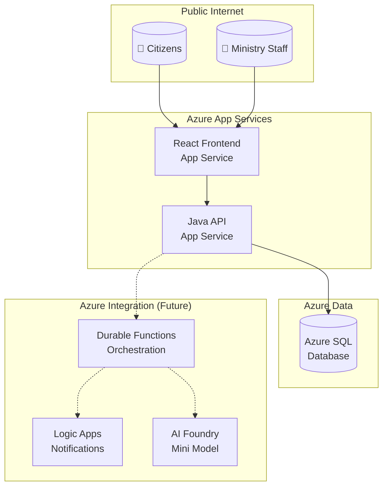

## Overview

This document describes the system architecture for CIVIC (Citizens' Ideas for a Vibrant and Inclusive Community), a government program submission and approval system for Ontario citizens.

## System Overview

CIVIC consists of three primary tiers:

1. **Presentation Tier** — React frontend served via Azure App Service
2. **Application Tier** — Spring Boot API handling business logic
3. **Data Tier** — Azure SQL Database for persistent storage

Future integrations include Azure Durable Functions for orchestration, Logic Apps for notifications, and AI Foundry for intelligent processing.

## Architecture Diagram



## Component Descriptions

### React Frontend

| Property       | Value                                      |
|----------------|--------------------------------------------|
| Technology     | React 18 + TypeScript + Vite               |
| Port           | 3000 (development) / 443 (production)      |
| UI Framework   | Ontario Design System                      |
| i18n           | i18next (English/French)                   |
| Accessibility  | WCAG 2.2 Level AA compliant                |

The frontend provides two user experiences:

* **Citizen Portal** — Submit and track program requests
* **Ministry Portal** — Review, approve, and reject submissions

### Java API

| Property       | Value                                      |
|----------------|--------------------------------------------|
| Technology     | Java 21 + Spring Boot 3.x                  |
| Port           | 8080 (development) / 443 (production)      |
| Data Access    | Spring Data JPA                            |
| Migrations     | Flyway                                     |
| Error Format   | RFC 7807 ProblemDetail                     |

The backend provides RESTful endpoints for:

* Program submission (POST /api/programs)
* Program listing and search (GET /api/programs)
* Program details (GET /api/programs/{id})
* Program review (PUT /api/programs/{id}/review)
* Program types lookup (GET /api/program-types)

### Azure SQL Database

| Property       | Value                                      |
|----------------|--------------------------------------------|
| Service        | Azure SQL Database                         |
| Local Dev      | H2 with MODE=MSSQLServer                   |
| Tables         | program_type, program, notification        |
| Text Encoding  | NVARCHAR for bilingual support             |

## Data Flow

### Program Submission Flow

1. Citizen accesses the React frontend
2. Frontend submits program data to Java API
3. API validates and persists to Azure SQL
4. API returns confirmation with program ID
5. Frontend displays success message

### Program Review Flow

1. Ministry staff accesses the review dashboard
2. Frontend fetches pending programs from API
3. Staff reviews and submits approval/rejection
4. API updates program status and timestamps
5. (Future) Durable Functions triggers notification workflow

## Security

### Authentication

* Future: MyOntario account integration for citizens
* Future: Azure AD authentication for Ministry staff
* Current demo: Open access for demonstration purposes

### Authorization

Role-based access control (RBAC) pattern:

| Role      | Permissions                                |
|-----------|--------------------------------------------|
| Citizen   | Submit programs, view own submissions      |
| Reviewer  | View all programs, approve/reject          |
| Admin     | Full access, manage program types          |

### Data Protection

* All data encrypted at rest (Azure SQL TDE)
* All traffic encrypted in transit (TLS 1.2+)
* No PII stored beyond contact email for notifications

## Integration Points

### Current Integrations

| System         | Purpose                                    |
|----------------|--------------------------------------------|
| Azure SQL      | Primary data storage                       |
| GitHub Actions | CI/CD pipeline                             |
| Azure DevOps   | Work item tracking                         |

### Future Integrations (Dashed Lines in Diagram)

| System           | Purpose                                  |
|------------------|------------------------------------------|
| Durable Functions| Workflow orchestration                   |
| Logic Apps       | Email notifications                      |
| AI Foundry       | Intelligent categorization/summarization |

## Deployment Architecture

### Local Development

```text
┌─────────────┐     ┌─────────────┐     ┌─────────────┐
│   Browser   │────▶│ Vite Dev    │────▶│ Spring Boot │
│  localhost  │     │ :3000       │     │ :8080       │
└─────────────┘     └─────────────┘     └─────────────┘
                                              │
                                              ▼
                                        ┌─────────────┐
                                        │ H2 Database │
                                        │ (in-memory) │
                                        └─────────────┘
```

### Azure Production

```text
┌─────────────┐     ┌─────────────┐     ┌─────────────┐
│   Browser   │────▶│ App Service │────▶│ App Service │
│  Internet   │     │ (React)     │     │ (Java API)  │
└─────────────┘     └─────────────┘     └─────────────┘
                                              │
                                              ▼
                                        ┌─────────────┐
                                        │ Azure SQL   │
                                        │ Database    │
                                        └─────────────┘
```

## Technology Stack Summary

| Layer          | Technology                                 |
|----------------|--------------------------------------------|
| Frontend       | React 18 + TypeScript + Vite               |
| Backend        | Java 21 + Spring Boot 3.x                  |
| Database       | Azure SQL (H2 for local)                   |
| UI Framework   | Ontario Design System                      |
| i18n           | i18next                                    |
| Cloud          | Azure App Services                         |
| CI/CD          | GitHub Actions                             |
| Security       | GitHub Advanced Security                   |
| Project Mgmt   | Azure DevOps                               |
