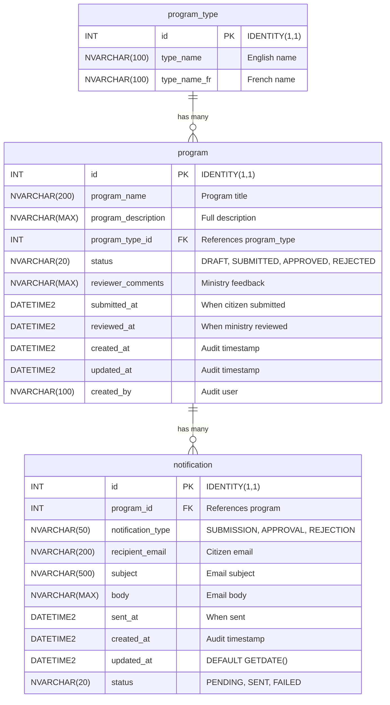

## Overview

This document defines the database schema for the CIVIC (Citizens' Ideas for a Vibrant and Inclusive Community) program submission system.

## Entity Relationship Diagram



## Table Specifications

### program_type (Lookup Table)

Static reference data for program categorization. No audit columns required.

| Column       | Type           | Constraints   | Description                    |
|--------------|----------------|---------------|--------------------------------|
| id           | INT            | PK, IDENTITY  | Primary key, auto-increment    |
| type_name    | NVARCHAR(100)  | NOT NULL, UQ  | English display name           |
| type_name_fr | NVARCHAR(100)  | NOT NULL      | French display name            |

**Relationships:**

* One-to-many with `program` table via `program_type_id`

**SQL Definition:**

```sql
CREATE TABLE program_type (
    id INT IDENTITY(1,1) PRIMARY KEY,
    type_name NVARCHAR(100) NOT NULL,
    type_name_fr NVARCHAR(100) NOT NULL,
    CONSTRAINT UQ_program_type_type_name UNIQUE (type_name)
);
```

### program (Transactional Table)

Core entity storing citizen program submissions.

| Column              | Type           | Constraints        | Description                                  |
|---------------------|----------------|--------------------|--------------------------------------------- |
| id                  | INT            | PK, IDENTITY       | Primary key, auto-increment                  |
| program_name        | NVARCHAR(200)  | NOT NULL           | Program title                                |
| program_description | NVARCHAR(MAX)  | NOT NULL           | Full program description                     |
| program_type_id     | INT            | FK, NOT NULL       | References program_type(id)                  |
| status              | NVARCHAR(20)   | DEFAULT 'DRAFT'    | DRAFT, SUBMITTED, APPROVED, REJECTED         |
| reviewer_comments   | NVARCHAR(MAX)  | NULL               | Ministry feedback on review                  |
| submitted_at        | DATETIME2      | NULL               | Timestamp when citizen submitted             |
| reviewed_at         | DATETIME2      | NULL               | Timestamp when ministry reviewed             |
| created_at          | DATETIME2      | NOT NULL           | Record creation timestamp                    |
| updated_at          | DATETIME2      | NOT NULL           | Last modification timestamp                  |
| created_by          | NVARCHAR(100)  | NULL               | User who created record                      |

**Relationships:**

* Many-to-one with `program_type` table
* One-to-many with `notification` table

**Status Values:**

| Status     | Description                              |
|------------|------------------------------------------|
| DRAFT      | Initial state, not yet submitted         |
| SUBMITTED  | Citizen has submitted for review         |
| APPROVED   | Ministry has approved the program        |
| REJECTED   | Ministry has rejected the program        |

**SQL Definition:**

```sql
CREATE TABLE program (
    id INT IDENTITY(1,1) PRIMARY KEY,
    program_name NVARCHAR(200) NOT NULL,
    program_description NVARCHAR(MAX) NOT NULL,
    program_type_id INT NOT NULL,
    status NVARCHAR(20) DEFAULT 'DRAFT',
    reviewer_comments NVARCHAR(MAX) NULL,
    submitted_at DATETIME2 NULL,
    reviewed_at DATETIME2 NULL,
    created_at DATETIME2 NOT NULL DEFAULT GETDATE(),
    updated_at DATETIME2 NOT NULL DEFAULT GETDATE(),
    created_by NVARCHAR(100) NULL,
    CONSTRAINT FK_program_program_type FOREIGN KEY (program_type_id) 
        REFERENCES program_type(id),
    CONSTRAINT CK_program_status CHECK (status IN ('DRAFT', 'SUBMITTED', 'APPROVED', 'REJECTED'))
);

CREATE INDEX IX_program_status ON program(status);
CREATE INDEX IX_program_program_type_id ON program(program_type_id);
```

### notification (Transactional Table)

Stores email notification records for program status changes.

| Column            | Type           | Constraints        | Description                     |
|-------------------|----------------|--------------------|---------------------------------|
| id                | INT            | PK, IDENTITY       | Primary key, auto-increment     |
| program_id        | INT            | FK, NOT NULL       | References program(id)          |
| notification_type | NVARCHAR(50)   | NOT NULL           | SUBMISSION, APPROVAL, REJECTION |
| recipient_email   | NVARCHAR(200)  | NOT NULL           | Citizen email address           |
| subject           | NVARCHAR(500)  | NOT NULL           | Email subject line              |
| body              | NVARCHAR(MAX)  | NOT NULL           | Email body content              |
| sent_at           | DATETIME2      | NULL               | When email was sent             |
| created_at        | DATETIME2      | NOT NULL           | Record creation timestamp       |
| updated_at        | DATETIME2      | DEFAULT GETDATE()  | Last modification timestamp     |
| status            | NVARCHAR(20)   | DEFAULT 'PENDING'  | PENDING, SENT, FAILED           |

**Relationships:**

* Many-to-one with `program` table

**Notification Types:**

| Type        | Trigger                                  |
|-------------|------------------------------------------|
| SUBMISSION  | Citizen submits a program                |
| APPROVAL    | Ministry approves a program              |
| REJECTION   | Ministry rejects a program               |

**Status Values:**

| Status   | Description                              |
|----------|------------------------------------------|
| PENDING  | Notification queued, not yet sent        |
| SENT     | Notification successfully delivered      |
| FAILED   | Notification delivery failed             |

**SQL Definition:**

```sql
CREATE TABLE notification (
    id INT IDENTITY(1,1) PRIMARY KEY,
    program_id INT NOT NULL,
    notification_type NVARCHAR(50) NOT NULL,
    recipient_email NVARCHAR(200) NOT NULL,
    subject NVARCHAR(500) NOT NULL,
    body NVARCHAR(MAX) NOT NULL,
    sent_at DATETIME2 NULL,
    created_at DATETIME2 NOT NULL DEFAULT GETDATE(),
    updated_at DATETIME2 NOT NULL DEFAULT GETDATE(),
    status NVARCHAR(20) DEFAULT 'PENDING',
    CONSTRAINT FK_notification_program FOREIGN KEY (program_id) 
        REFERENCES program(id),
    CONSTRAINT CK_notification_status CHECK (status IN ('PENDING', 'SENT', 'FAILED')),
    CONSTRAINT CK_notification_type CHECK (notification_type IN ('SUBMISSION', 'APPROVAL', 'REJECTION'))
);

CREATE INDEX IX_notification_program_id ON notification(program_id);
CREATE INDEX IX_notification_status ON notification(status);
```

## Seed Data

### Program Types

Initial program categories with bilingual names:

| id | type_name                  | type_name_fr                  |
|----|----------------------------|-------------------------------|\n| 1  | Community Services         | Services communautaires       |
| 2  | Health & Wellness          | Santé et bien-être            |
| 3  | Education & Training       | Éducation et formation        |
| 4  | Environment & Conservation | Environnement et conservation |
| 5  | Economic Development       | Développement économique      |

### Seed Data SQL

Use `INSERT ... WHERE NOT EXISTS` pattern for idempotent seeding:

```sql
INSERT INTO program_type (type_name, type_name_fr)
SELECT 'Community Services', 'Services communautaires'
WHERE NOT EXISTS (
    SELECT 1 FROM program_type WHERE type_name = 'Community Services'
);

INSERT INTO program_type (type_name, type_name_fr)
SELECT 'Health & Wellness', 'Santé et bien-être'
WHERE NOT EXISTS (
    SELECT 1 FROM program_type WHERE type_name = 'Health & Wellness'
);

INSERT INTO program_type (type_name, type_name_fr)
SELECT 'Education & Training', 'Éducation et formation'
WHERE NOT EXISTS (
    SELECT 1 FROM program_type WHERE type_name = 'Education & Training'
);

INSERT INTO program_type (type_name, type_name_fr)
SELECT 'Environment & Conservation', 'Environnement et conservation'
WHERE NOT EXISTS (
    SELECT 1 FROM program_type WHERE type_name = 'Environment & Conservation'
);

INSERT INTO program_type (type_name, type_name_fr)
SELECT 'Economic Development', 'Développement économique'
WHERE NOT EXISTS (
    SELECT 1 FROM program_type WHERE type_name = 'Economic Development'
);
```

**Note:** Never use MERGE statement — it is not portable to H2 local development database.

## Naming Conventions

### Table Names

* Lowercase with underscores
* Singular form (e.g., `program` not `programs`)

### Column Names

* Lowercase with underscores
* Foreign keys prefixed with referenced table name (e.g., `program_type_id`)

### Constraint Names

| Type         | Pattern                    | Example                    |
|--------------|----------------------------|----------------------------|
| Primary Key  | PK_{table}                 | PK_program                 |
| Foreign Key  | FK_{child}_{parent}        | FK_program_program_type    |
| Unique       | UQ_{table}_{column}        | UQ_program_type_type_name  |
| Check        | CK_{table}_{column}        | CK_program_status          |
| Index        | IX_{table}_{column}        | IX_program_status          |

## Data Integrity Rules

1. All programs must have a valid program_type_id
2. Status values are restricted via CHECK constraints
3. Notification types are restricted via CHECK constraints
4. Timestamps use DATETIME2 for precision
5. Bilingual text uses NVARCHAR for Unicode support
